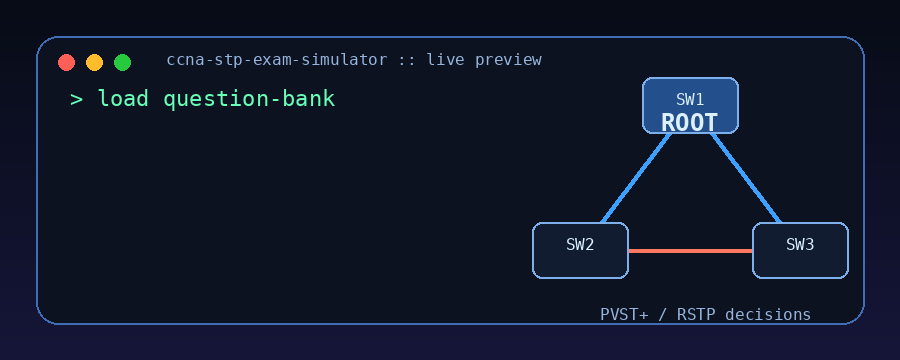
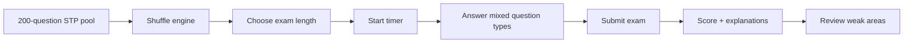

<div align="center">

# 🧠 CCNA STP / Rapid PVST+ Exam Simulator

<p align="center">
  <a href="https://sudo017.github.io/ccna-stp-exam-simulator/">
    
  </a>
</p>

### A timed, randomized STP exam cockpit for serious CCNA switching practice.



<br/>


</div>

---

## 🎯 Why this exists

I built this while preparing for the **Cisco CCNA 200-301** because STP is one of those topics that looks simple until the exam turns it into a topology puzzle.

You can memorize that the lowest bridge ID wins.

That is not enough.

The real challenge is answering questions like:

```text
Which port blocks if the root path cost ties?
Why is this port alternate and not designated?
What happens if a PortFast interface receives a BPDU?
Which command fixes this exact scenario?
What does this show spanning-tree output actually prove?
```

This simulator is designed to pressure-test STP knowledge the way the exam does: scenarios, outputs, commands, topology decisions, and traps where guessing breaks fast.

---

## 🧩 What the simulator does



It is a browser-based quiz app with a randomized exam mode, configurable timer, and detailed review screen after submission.

The goal is not to make STP feel easy.

The goal is to expose exactly where your understanding is weak.

---

## 🧠 Question design

The pool contains **200 STP-focused questions** built around CCNA-level switching logic.

| Question family            | What it tests                                                      |
| -------------------------- | ------------------------------------------------------------------ |
| 🏆 Root bridge election    | Bridge ID, extended system ID, priority, MAC tie-breakers          |
| 🔌 Port role decisions     | Root port, designated port, alternate port, backup port            |
| ⚡ Rapid STP / Rapid PVST+ | RSTP states, roles, edge ports, proposal/agreement behavior        |
| 🧱 PVST+ behavior          | Per-VLAN STP instances, VLAN-specific root placement, load sharing |
| 🛡️ STP protection          | BPDU Guard, Root Guard, Loop Guard, BPDU Filter, PortFast          |
| 🖥️ IOS commands            | Configuration and verification commands                            |
| 📟 Output analysis         | `show spanning-tree`, blocked ports, root ID vs bridge ID          |
| 🧭 Topology scenarios      | Multi-switch path-cost decisions and blocking logic                |
| 🧷 Matching questions      | Drag/drop-style concept mapping                                    |

---

## 🕹️ Question types

This is not a basic multiple-choice dump.

The simulator includes several exam-style formats:

```text
[1] Best-answer MCQ
[2] Multi-select MCQ
[3] IOS command entry
[4] Topology exhibit analysis
[5] show spanning-tree output interpretation
[6] Drag/drop-style matching
[7] Scenario-based troubleshooting
```

Some command questions include optional hints, but using a hint applies a small score penalty.

Because in the real exam, the hint is your preparation.

---

## 🧪 Example skills you will be forced to prove

### Root election

```text
VLAN 10
SW1 priority 32768 MAC 0000.1111.1111
SW2 priority 32768 MAC 0000.2222.2222
SW3 priority 28672 MAC 0000.3333.3333

Question:
Which switch becomes the root bridge?
```

You need to know that STP compares the full bridge ID, not just the switch name, interface speed, or topology position.

---

### Port role logic

```text
SW1 is root.
SW3 has two paths:

Direct to SW1: FastEthernet cost 19
Via SW2: Gigabit + Gigabit cost 8

Question:
Which port becomes SW3's root port?
```

This is where weak STP understanding usually collapses. The visually direct path is not always the best STP path.

---

### Protection feature judgment

```text
A PortFast access port receives a BPDU.

Question:
Which protection feature shuts the interface down?
```

You need to distinguish:

```text
BPDU Guard       -> err-disabled
Root Guard       -> root-inconsistent
Loop Guard       -> loop-inconsistent
BPDU Filter      -> dangerous if misused
```

---

## 🧭 STP coverage map

```text
STP fundamentals               ████████████████████
Root bridge election           ████████████████████
Root/designated/alternate      ████████████████████
Path-cost tie-breakers         ████████████████████
Classic STP states             ████████████████░░░░
Rapid STP states and roles     ████████████████████
PVST+ and Rapid PVST+          ████████████████████
PortFast                       ██████████████████░░
BPDU Guard                     ████████████████████
Root Guard                     ████████████████████
Loop Guard                     ████████████████████
BPDU Filter                    ███████████████░░░░░
IOS configuration              ████████████████████
show command analysis          ████████████████████
```

---

## 🚀 Run locally

You need **Node.js** installed.

Then run:

```bash
npm install
npm run dev
```

Open the local URL shown in the terminal, usually:

```text
http://localhost:5173/
```

Do not open `index.html` directly.

This is a Vite React app, so it must run through the local development server.

---

## 🏗️ Build locally

```bash
npm run build
npm run preview
```

---

## 🧱 Tech stack

| Layer            | Tool                     |
| ---------------- | ------------------------ |
| Frontend         | React                    |
| Build tool       | Vite                     |
| Styling          | Custom CSS               |
| Question engine  | JavaScript question bank |
| Deployment-ready | Static build output      |

---

## 📁 Project structure

```text
ccna-stp-exam-simulator/
├── public/
├── src/
│   ├── App.jsx
│   ├── main.jsx
│   ├── questionBank.js
│   └── styles.css
├── assets/
│   └── stp-exam-cockpit.gif
├── index.html
├── package.json
├── vite.config.js
└── README.md
```

---

## 🔬 How the scoring works

The simulator tracks:

- total answered questions
- remaining unanswered questions
- correct answers
- wrong answers
- hint usage
- final score after hint penalties
- explanation review after submission

Command questions are normalized, so minor spacing differences do not instantly destroy the answer.

The intent is to test understanding, not punish formatting noise.

---

## 🧠 What I wanted this project to fix

Most CCNA practice apps treat STP like a definition topic.

It is not.

STP is a decision engine.

This simulator trains the decision process:

```text
1. Identify the root bridge.
2. Calculate root path cost.
3. Pick root ports.
4. Elect designated ports per segment.
5. Block the losing redundant paths.
6. Apply Rapid STP behavior.
7. Recognize protection feature triggers.
8. Read IOS output without guessing.
```

If you can consistently explain those steps under timer pressure, STP stops being scary.

---

## 🛣️ Future improvements

- Add screenshot-based topology exhibits
- Add difficulty filters
- Add per-topic performance analytics
- Add saved exam history
- Add CCNA mixed switching mode: VLANs, trunks, EtherChannel, STP
- Add Packet Tracer / GNS3 mini-lab companion tasks
- Add exportable weak-topic report

---

## 👤 Author

Built by **[@sudo017](https://github.com/sudo017)** while preparing for the CCNA and sharpening switching fundamentals through repetition, topology analysis, and failure-case thinking.

---

<div align="center">

### ⭐ If this helps you stop guessing STP, star the repo.

```text
Root bridge elected.
Alternate port blocked.
Loop avoided.
Exam mode: ready.
```

</div>
