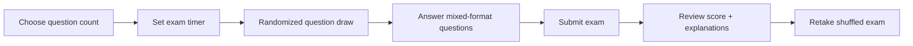

<div align="center">

<!-- HEADER -->


<!-- TYPING SVG -->
<a href="https://git.io/typing-svg">
  
</a>

<br/>

<!-- BADGES -->


<br/><br/>

> **A browser-based CCNA switching exam simulator focused on STP, PVST+, Rapid PVST+, port roles, root election, guard features, IOS commands, and real troubleshooting logic.**

</div>

---

## 🧠 Why I Built This

I built this project while preparing for the **Cisco CCNA 200-301** because **Spanning Tree Protocol is one of those topics that looks easy until the exam starts asking topology, tie-breaker, and troubleshooting questions at the same time**.

STP is not just “one port blocks to prevent loops.”

To actually be ready, you need to understand:

- why a switch becomes the **root bridge**
- why a specific port becomes the **root port**
- why another port becomes **designated, alternate, backup, blocking, or forwarding**
- how **PVST+ / Rapid PVST+** can create different forwarding paths per VLAN
- how to read `show spanning-tree` output without guessing
- when to use **PortFast, BPDU Guard, Root Guard, Loop Guard, and BPDU Filter**
- which IOS command fixes or verifies the exact situation

So I wanted a tool that does more than basic flashcards.

This simulator is designed to pressure-test STP knowledge the same way a real CCNA-style question does:  
**small topology, small detail, one correct decision.**

---

## ⚡ Project Preview

<div align="center">


<br/>

### *When STP chooses the port you did not expect... check the bridge ID, cost, sender BID, sender port ID, then local port ID.*

</div>

---

## 🎯 What This Simulator Tests

| Area | What You Get Tested On |
|:---|:---|
| 🌉 **STP Fundamentals** | loop prevention, BPDUs, bridge ID, root bridge election |
| 🧮 **Tie-Breakers** | priority, extended system ID, MAC address, root path cost, sender BID, sender port ID, local port ID |
| 🔀 **Port Roles** | root port, designated port, alternate port, backup port |
| 🚦 **Port States** | blocking, listening, learning, forwarding, discarding |
| ⚡ **Rapid PVST+** | RSTP roles/states, edge ports, proposal/agreement, faster convergence |
| 🧩 **PVST+ Logic** | different STP instances per VLAN, per-VLAN root placement, VLAN-based load sharing |
| 🛡️ **STP Protection** | PortFast, BPDU Guard, Root Guard, Loop Guard, BPDU Filter |
| 🖥️ **Cisco IOS Commands** | configuration, verification, troubleshooting, recovery |
| 🔎 **Output Analysis** | `show spanning-tree`, blocked ports, root ID vs bridge ID, inconsistent states |
| 🧪 **Scenario Reasoning** | topology exhibits, failure cases, edge-port mistakes, guard feature selection |

---

## 🧪 Question Types

This is not a boring MCQ-only quiz.

The pool includes multiple CCNA-style formats:

- ✅ **Best-answer multiple choice**
- ✅ **Multi-select questions**
- ✅ **Command-entry questions**
- ✅ **Topology / exhibit analysis**
- ✅ **`show spanning-tree` output interpretation**
- ✅ **Drag-and-drop style matching**
- ✅ **Scenario-based troubleshooting**
- ✅ **Guard-feature decision questions**
- ✅ **Rapid PVST+ convergence logic**
- ✅ **Root election and port-role calculation**

The goal is simple:

> **If I can survive this simulator, STP questions in CCNA should feel familiar instead of random.**

---

## 🧬 How It Works

<div align="center">



</div>

### Inside the app

1. Choose how many questions you want from the pool.
2. Set your timer.
3. Start the simulated exam.
4. Answer randomized questions.
5. Submit when done.
6. Review every answer with explanations.
7. Retake with a new shuffle.

---

## 🧠 Example Question Categories

<details>
<summary><b>🌉 Root Bridge Election</b></summary>

Questions force you to compare:

- bridge priority
- extended system ID
- VLAN ID
- MAC address
- `root primary` / `root secondary`
- default priority behavior

Example logic:

```text
Lowest bridge ID wins.
Bridge ID = priority + extended system ID + MAC address.
If priority ties, lowest MAC wins.
```

</details>

<details>
<summary><b>🔌 Root Port / Designated Port Selection</b></summary>

You get topology questions where you must calculate:

- lowest root path cost
- lowest sender bridge ID
- lowest sender port ID
- lowest local port ID

```text
Root port tie-breakers:
1. Lowest root path cost
2. Lowest sender bridge ID
3. Lowest sender port ID
4. Lowest local port ID
```

</details>

<details>
<summary><b>⚡ Rapid PVST+</b></summary>

Rapid PVST+ questions cover:

- discarding / learning / forwarding
- root / designated / alternate / backup roles
- edge ports
- proposal/agreement
- compatibility with classic STP
- faster convergence behavior

</details>

<details>
<summary><b>🛡️ STP Protection Features</b></summary>

You are tested on when to use:

| Feature | Main Use |
|:---|:---|
| **PortFast** | Edge ports connected to end hosts |
| **BPDU Guard** | Shut an edge port if it receives BPDUs |
| **Root Guard** | Prevent an unexpected switch from becoming root |
| **Loop Guard** | Prevent loops when expected BPDUs stop arriving |
| **BPDU Filter** | Suppress BPDUs, dangerous if misused |

</details>

<details>
<summary><b>🖥️ IOS Command Practice</b></summary>

Command questions include syntax like:

```bash
spanning-tree mode rapid-pvst
spanning-tree vlan 10 root primary
spanning-tree vlan 20 priority 24576
spanning-tree portfast
spanning-tree bpduguard enable
spanning-tree guard root
spanning-tree guard loop
show spanning-tree vlan 10
show spanning-tree summary
show spanning-tree blockedports
```

</details>

---

## 🚀 Features

<div align="center">

| Feature | Description |
|:---|:---|
| 🎲 **Randomized Exams** | Draws a random set of questions from the full pool |
| ⏱️ **Timer Mode** | Simulates exam pressure |
| 🧠 **200+ STP Questions** | Focused on CCNA switching depth |
| 🧩 **Mixed Formats** | MCQ, multi-select, command input, matching, exhibits |
| 📊 **Score Review** | Shows correct/wrong answers after submission |
| 💬 **Explanations** | Every question has reasoning, not just an answer |
| 🎨 **Theme Toggle** | Blue and red modes |
| ⚡ **Fast Frontend** | Built with React + Vite |

</div>

---

## 🛠️ Tech Stack

<div align="center">


</div>

---

## 📂 Project Structure

```text
ccna-stp-exam-simulator/
│
├── src/
│   ├── App.jsx              # Main simulator UI and exam logic
│   ├── questionBank.js      # STP / PVST+ / Rapid PVST+ question pool
│   ├── main.jsx             # React entry point
│   └── styles.css           # Custom UI styling
│
├── index.html
├── package.json
├── vite.config.js
└── README.md
```

---

## 🧑‍💻 Run Locally

> Do not open `index.html` directly. This is a React/Vite app, so it needs the local dev server.

```bash
npm install
npm run dev
```

Then open the URL shown in the terminal, usually:

```text
http://localhost:5173/
```

---

## 🏗️ Build Locally

```bash
npm run build
npm run preview
```

---

## 🧭 What I Learned Building This

Building the simulator helped reinforce the exact parts of STP that usually cause mistakes:

- STP is deterministic; there is always a reason a port wins or loses.
- Root bridge election is simple until extended system ID and VLANs enter the picture.
- PVST+ means the same physical port can behave differently per VLAN.
- Rapid PVST+ is not just “faster STP”; it changes roles, states, and convergence behavior.
- Guard features are not interchangeable.
- `show spanning-tree` output tells the answer if you know where to look.

---

## 🚧 Possible Future Improvements

- [ ] Add topic-based practice mode
- [ ] Add difficulty filters
- [ ] Add per-topic score breakdown
- [ ] Add saved progress in local storage
- [ ] Add more `show spanning-tree` troubleshooting outputs
- [ ] Add CCNA mixed switching mode: VLANs, trunks, EtherChannel, STP combined
- [ ] Add a clean demo GIF from the actual app

---

## 👨‍💻 Author

<div align="center">

Created by **[Sudo017](https://github.com/Sudo017)**  
Computer Engineering Student · Network Engineering & IT Infrastructure Focus · CCNA 200-301 In Progress

<br/>

<a href="https://github.com/Sudo017">
  
</a>
<a href="https://www.linkedin.com/in/ayoub-hamed1/">
  
</a>

</div>

---

<div align="center">

### ⭐ If this helps you revise STP, give it a star.


</div>
